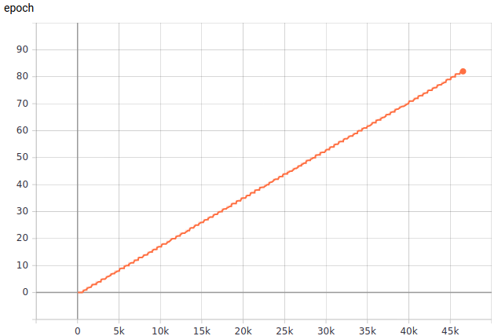
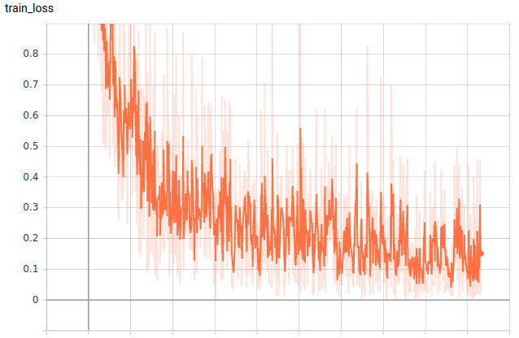
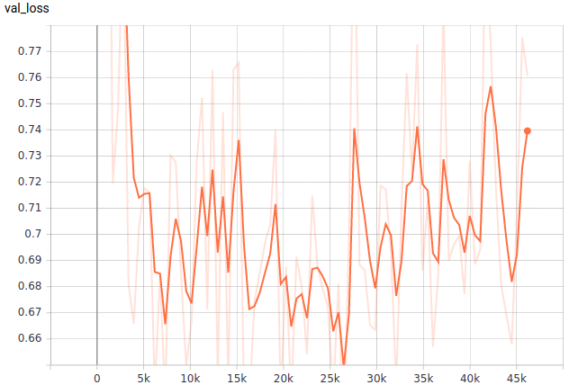

# **Food_Recognition_PyTorch**
Zadanie polegało na stworzeniu modelu, który klasyfikuje jedzenie na zdrowe i niezdrowe.  
## **Dataset**
Skorzystałem z datasetu [Food-101](https://www.kaggle.com/kmader/food41).  
Wybrałem z niego 20 klas i podzieliłem na zdrowe i niezdrowe:  
**Zdrowe:**
* beet_salad
* bibimbap
* caesar_salad
* edamame
* greek_salad
* grilled_salmon
* omelette
* ramen
* seaweed_salad
* sushi  

**Niezdrowe:**
* chocolate_mousse
* churros
* cup_cakes
* donuts
* grilled_cheese_sandwich
* hamburger
* hot_dog
* ice_cream
* lasagna
* pizza  

Każda z klas zawierała po 1000 zdjęć, które podzieliłem na train set (900 zdjęć) oraz validation set (100 zdjęć).  
## **Sieci**
Domyślnie jedzenie miało być klasyfikowane na 2 klasy, ale z powodu dużej różnicy w wyglądzie pewnych dań stwierdziłem, że lepiej będzie uczyć sieć na 20 klasach.  
Wtedy funkcja loss ma więcej minimów, które są bardziej osiągalne. Po nauce należałoby jedynie zrobić macierz, która mapuje nasze 20 klas na 2 klasy.
### **MY_CNN**
Na cele projektu spróbowałem najpierw od stworzenia własnej konwolucyjnej sieci neuronowej [Moja sieć](./my_cnn/mycnn.py).  
Niestety na tą chwilę nie mam tensorboard_logs, więc póki co nie przedstawię progresu w nauce.  
Zdjęcia skalowałem do rozmiaru 128x128, zapewniło to możliwość dość szybkiej nauki bez zbytniej utraty danych przy batch_size = 64.  
Z powodu dość małego datasetu należało dobrać agresywne podejście w odmentacji danych, mimo to bardzo szybko dochodziło do overfittingu.  
Z tego powodu sieć ma dość wysoki średni val_loss oraz train_loss. Sieć była trenowana przez 130 epochów, przy czym najniższy val_loss otrzymałem w 75 epochu, dalej nastąpił overfitting. Model na repozytorium to właśnie ten z 75 epocha z najlepszym val_loss.   
Sieć klasyfikuje jedzenie na 20 klas z dokładnością **60%** 
Sieć klasyfikuje jedzenie na 2 klasy po mapowaniu z dokładnością **83%**  
Bardzo możliwe, że mogło być lepiej, ale z powodu upływającego czasu wolałem przejść na coś bardziej pewnego - transfer learning.
### **WITH_RESNET**
Do transfer learningu wykorzystałem sieć [ResNet18](https://pytorch.org/hub/pytorch_vision_resnet/), która była już pre-trenowana na 1000 klasach obiektów.  
Na cele zadania należało jedynie wykorzystać już nabytą przez model wiedzę na temat odróżniania kształtów i lekko "douczyć", aby mógł poprawnie klasyfikować nasz zbiór.  
W tym celu stworzyłem nowy klasyfikator, który zastąpi już istniejący. Nowy klasyfikator to głębokie sieci neuronowe o 4 warstwach, z czego jedna to output.  
Dodatkowo zablokowałem cały model poza 2 ostatnimi warstwami oraz warstwami typu BatchNorm, aby model mógł się jeszzcze bardziej "dostroić" do naszego datasetu.  
Zablokowanie pozostałych warstw pozwoli na naukę na małym zbiorze danych, utrudni wystąpienie zjawiska overfittingu.  
Eksperymentalnie dowiedziałem się, że ten model nie wymaga już aż tak agresywnego podejścia w odmentacji danych, więc wykorzystałem bezpieczniejsze i łagodniejsze podejście.  
Input modelu był wielkości 224x224, więc należało zmniejszyć zdjęcia przed procesem nauki. Z powodu większego rozmiaru musiałem zmniejszyć batch_size do 32 zdjęć.  
**Progress modelu:** 
 
 
 
Najlepszy val_loss był dokładnie w 46 epochu. Na repozytorium znajduje się model właśnie z tego momentu.  
Po skorzystaniu z ResNeta udało się otrzymać całkiem dobry loss oraz accuracy.  
Sieć klasyfikuje jedzenie na 20 klas z dokładnością **84.25%** 
Sieć klasyfikuje jedzenie na 2 klasy po mapowaniu z dokładnością **95.25%**
